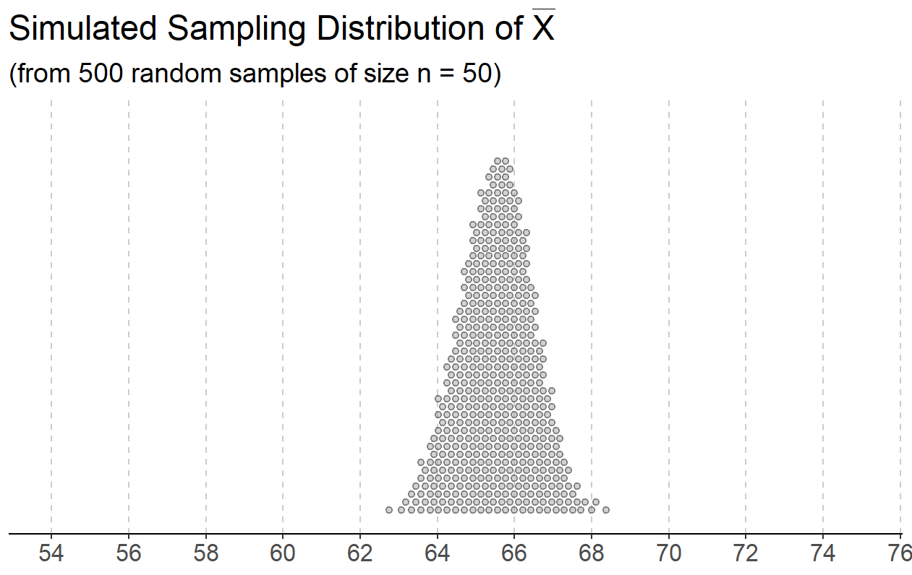

```{r setup, include=FALSE}
knitr::opts_chunk$set(echo = TRUE)
```

### Instructions

Complete the lab exercises and Dive Deeper questions below. Lab exercises will be graded out of 2 points each and the Dive Deeper questions will be graded out of 3 points each - all of them will be graded for *correctness*. Upon completion, follow the submission instructions at the bottom of this document. We strongly encourage you to work on this assignment with a partner, but each student must submit their own lab assignment.

***

### Background

[Source](https://www.kaggle.com/datasets/stefanoleone992/fifa-22-complete-player-dataset)

FIFA is a popular soccer video game developed by EA Sports. Listed as the best-selling sports video game in the world, FIFA allows gamers to play soccer matches using real players from all over the world. This data set contains information for **every** soccer player competing in the MLS (the most popular soccer league in the US). In other words, this data set contains *the population of all soccer players in the MLS*. (Note: goalkeepers have been removed.) The original file contains over 50 attributes for every player, but we have narrowed it down to the following eight variables.  

1. `club`: team
2. `positions`: a list of positions (ST - striker, CB - center back, etc.)
3. `height`: height (in cm)
4. `salary`: annual salary (in $1000's)
5. `speed`: speed (out of 100)
6. `shooting`: shooting ability (out of 100)
7. `dribbling`: dribbling ability (out of 100)
8. `defending`: defending ability (out of 100)


Use the following code chunk to read in the data set. 

```{r readData}
fifa <- read.csv("fifa.csv", row.names = 1)
```

You can preview the data below.

```{r previewData}
head(fifa)
```

And be sure to load in the required packages!

```{r loadPackages}
library(stats250package)
library(ggplot2)
library(ggdist)
```


***


### Lab Exercises

After reading the background above, complete the following lab exercises. Remember, these exercises are worth 2 points each and are graded for *correctness*.

> 1. After reading the background above, you are posed with two questions: (1) How many MLS players are listed as strikers (ST)? and (2) What is the typical height of an MLS player? For each question, identify the type (categorical or quantitative) for the variable of interest. Then, decide whether calculating a proportion or mean would be a more useful summary measure to answer the posed question. 

Identify the variable type and summary measure for Question (1)

- *Variable Type for the Variable of Interest:* categorical or quantitative
- *Summary Measure:* proportion or mean


Identify the variable type and summary measure for Question (2)

- *Variable Type for the Variable of Interest:* categorical or quantitative
- *Summary Measure:* proportion or mean


> 2. Using `ggplot()` create a histogram for the heights of all MLS soccer players. Be sure to include appropriate axis labels and a title. Comment on the shape of the histogram and eyeball the approximate mean (center).

```{r exercise2, error = T}
# Replace this comment with your code

```

*Answer:* Replace this text with your answer.


> 3. With the `height` variable and the `simMeans()` function, simulate the sampling distribution of the sample mean for random samples of size *10*. What does each dot in the plot represent? Be specific and provide context with your answer!

```{r exercise3, error = T}
# Replace this comment with your code

```

*Answer:* Replace this text with your answer. 


> 4. With the height variable and the `simMeans()` function, create the sampling distribution of the sample mean for random samples of size *20*. The resulting plot and your plot from Exercise 3 should result in bell-shaped (normal) sampling distributions. The Central Limit Theorem states that we need to take random samples of at least size 25 in order for the resulting sampling distribution to be approximately normal -- why are these sampling distributions normal even though the sample sizes are less than 25? 

```{r exercise4, error = T}
# Replace this comment with your code

```

*Answer:* Replace this text with your answer.


> 5. Pick a different *quantitative* variable from the FIFA data set. Create a histogram for your chosen variable. Be sure to include appropriate axis labels and a title. Comment on the shape of the histogram and eyeball the approximate mean (center).

```{r exercise5, error = T}
# Replace this comment with your code

```

*Answer:* Replace this text with your answer.


> 6. With the variable you picked in Exercise 5 and the `simMeans()` function, create the sampling distribution of the sample mean for random samples of size *25*. What does each dot in the plot represent? Be specific and provide context!

```{r exercise6, error = T}
# Replace this comment with your code

```

*Answer:* Replace this text with your answer.


> 7. With the variable you picked in Exercise 5 and the `simMeans()` function, create the sampling distribution of the sample mean for random samples of size *100*. How do the center and spread of this plot compare with the center and spread of the plot from Exercise 6? 

```{r exercise7, error = T}
# Replace this comment with your code

```

*Answer:* Replace this text with your answer.


***

### Dive Deeper Questions

After completing the lab exercises above, complete the following Dive Deeper questions. Remember, these questions are worth 3 points each and are graded for correctness.

> **1.** A student decided to analyze the `defending` variable in Exercises 5 - 7 and made the following *incorrect* statement. *"With a large sample size of 100, the distribution of defensive abilities for the sample of 100 players will be approximately normal because of the Central Limit Theorem."* Rewrite the statement to correctly reflect the Central Limit Theorem. 

*Answer:* Replace this text with your answer.


> **2.** Another variable included in the original data set was *overall* - which measures the overall skill of a player (out of 100 points). The sampling distribution of the sample mean for random samples of size *50* was created and is provided below. The sampling distribution is bell-shaped, but what about the population distribution for the `overall` variable? Can we determine if the shape of the population distribution for the `overall` variable is also normally distributed? In other words, if we were to plot the histogram of the variable overall skill for all 680 MLS players, do we know whether the histogram will follow a normal distrbution (based on the sampling distribution provided below)? Why or why not?

 

*Answer:* Replace this text with your answer.


***

### Submission Instructions

Once you have finished, follow the instructions below to submit your work.

1. At the top of the document, change the `author` field to your name (in quotes!). **Do not change any of the other fields (title, date, output) at the top of the document.**

2. Click the Knit button to create an HTML file of your work. If you get an error that says "Duplicate chunk label", go back and check your code chunk names - each one must have a unique name! 

3. In the Files pane (bottom right window), check the box next to `lab05_assignment.html`. 

4. In the Files pane, click on the gear icon (More) and select "Export..."  

5. Do not change the file name (`lab05_assignment.html`). Click Download and save the file to your computer. 

6. On the Stats 250 Canvas site, navigate to the Lab 5 assignment. 

7. Upload your saved `lab05_assignment.html` file. 

8. Click "Submit Assignment". Congratulations, you are done with Lab 5!


